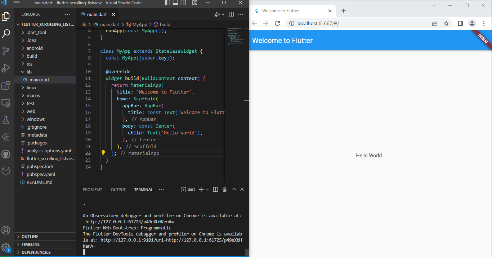
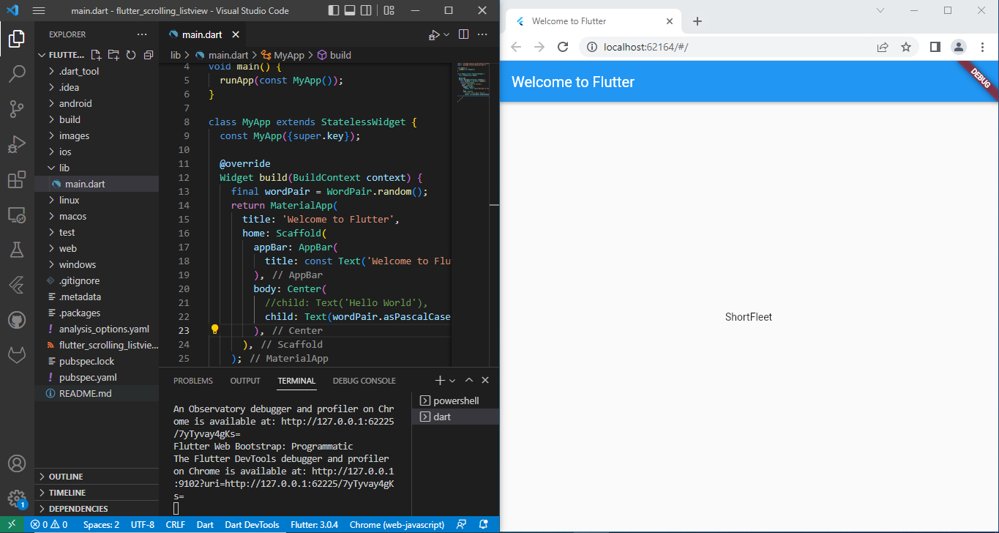
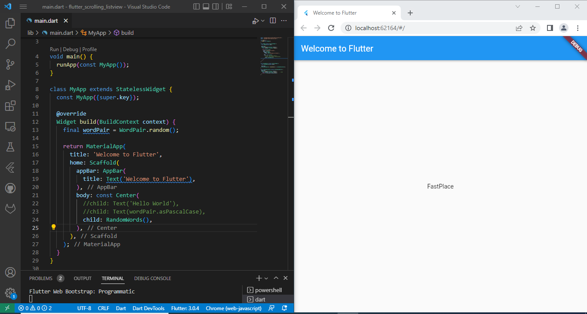
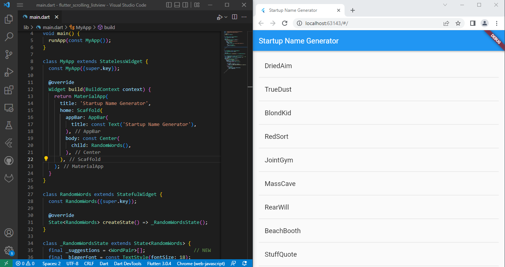

# flutter_scrolling_listview
# Baggio Deroger - Assignment Report

=>Creating the starter Flutter app

=>Using an external package

=>Adding a stateful widget

=>Creating an infinite scrolling ListView

